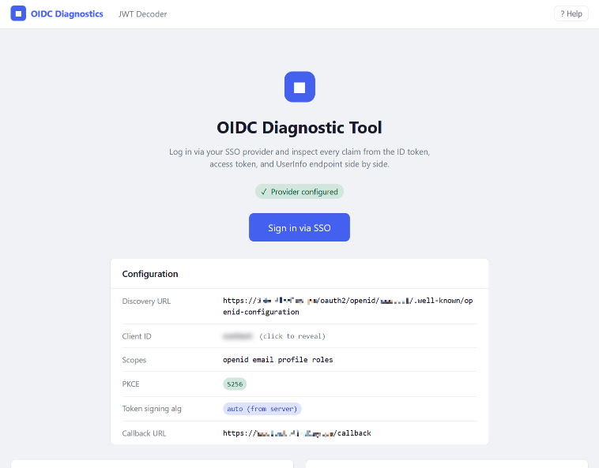

# OIDC Diagnostic Tool

A lightweight web application that acts as an OIDC client for diagnosing SSO systems. Log in via your provider (Keycloak, Kanidm, Authentik, Entra ID, Okta, etc.) and inspect every claim from the ID token, access token, and UserInfo endpoint side by side.

## Disclaimer
This tool was written collaboratively with AI: Claude Code - Claude Sonnet 4.6. [CLAUDE.md](CLAUDE.md) is included for reference.

## Features

### Claims view

- **Five-tab claims view** — ID Token · Access Token · UserInfo · Compare · Raw JWT
- **Compare tab** — shows every unique claim key across all three sources and flags ⚠ where the same claim has different values
- **Scope labelling** — each claim is badged with the OIDC scope that defines it; filter by scope with one click
- **Empty-scope warnings** — highlights scopes that were granted but returned no claims
- **Live search** — filter claims by name or value instantly
- **Mask sensitive values** — blur `sub`, `email`, `name`, etc. for safe screenshotting
- **Token expiry countdown** — live timer in the nav bar and claims header
- **Token refresh** — refresh the access token without signing out (requires `offline_access` scope)
- **Copy buttons** — per-claim copy and full JSON export

### JWT decoder

- **Standalone decoder** — paste any token and decode it without logging in
- **Token visualiser** — colour-coded header · payload · signature display
- **Expiry warning** — immediately flags tokens whose `exp` has passed
- **Token timeline** — visual bar showing `iat` → now → `exp`, with remaining time or expiry age
- **Decode history** — last 5 decoded tokens stored in browser `localStorage` with quick-restore
- **Token diff** — paste two JWTs and compare their claims side by side; highlights added, removed, and changed claims
- **How to get a JWT** — expandable guide covering DevTools, `curl`, Bearer headers, and Keycloak admin console

### Conformance & security analysis

- **OIDC conformance checks** — validates the provider's discovery document against OIDC Core 1.0 required and recommended fields
- **Security analysis** — checks for: `none` algorithm, HMAC signing keys, HTTPS on all endpoints, PKCE S256 support, `plain` PKCE, and algorithm strength (EC/PSS preferred over RSA PKCS#1 v1.5)
- **Token claim validation** — when signed in, validates `iss`, `aud`, `sub`, `exp`, `iat`, issuer match, and audience match against the configured client ID
- **RFC references** — every check cites the relevant specification (OIDC Core 1.0, RFC 8725, RFC 7636, RFC 9700, etc.)

### Multi-provider mode

- **Provider cards** — each provider gets its own card with connectivity check and provider metadata
- **Signed-in state** — the active provider card shows the signed-in username with Refresh, Sign out, and Claims buttons; inactive cards show Sign in
- **SHOW_CONFIG in multi-provider** — when `SHOW_CONFIG=true`, each provider card has a collapsible Configuration section showing that provider's discovery URL, client ID (masked), scopes, PKCE method, and callback URL
- **Scope analysis** — shows which scopes were granted and highlights any that returned no claims

### UI

- **Dark mode** — full dark theme toggle in the nav bar; respects `prefers-color-scheme` by default, persisted to `localStorage`
- **Connectivity checker** — checks both the app server and your browser can reach the OIDC provider
- **Provider discovery viewer** — fetches and displays the `.well-known/openid-configuration`, with your current PKCE method and signing algorithm highlighted
- **RP-initiated logout** — redirects to the provider's `end_session_endpoint` where supported
- **PKCE S256** — enabled by default; required by Kanidm, recommended everywhere
- **ES256 / RS256** — configurable token signing algorithm enforcement
- **Help menu** — connectivity guide, scope reference, and OIDC flow diagram

---



---

## Quickstart with Docker

The fastest way to run the tool is with the pre-built image from GitHub Container Registry.

**1. Create a `.env` file:**

```bash
curl -o .env https://raw.githubusercontent.com/tfindley/sso_oidc_client_tool/main/.env.example
# Edit .env with your provider details
```

**2. Run with Docker Compose:**

```bash
docker compose up
```

Then open [http://localhost:5000](http://localhost:5000).

---

## Multi-Provider Setup

To configure more than one OIDC provider, use `providers.yml` instead of `.env` variables.

**1. Copy the example file:**

```bash
cp providers.example.yml providers.yml
```

**2. Edit `providers.yml`** with your provider details. Each provider entry requires:

| Field | Required | Description |
| --- | --- | --- |
| `name` | Yes | Display name shown on the login button |
| `id` | Yes | URL-safe identifier — used in `/login/<id>` and `/callback/<id>` |
| `discovery_url` | Yes | Provider's `/.well-known/openid-configuration` URL |
| `client_id` | Yes | OAuth2 client ID |
| `client_secret` | Yes | OAuth2 client secret |
| `scope` | No | Space-separated scopes (default: `openid email profile`) |
| `pkce_method` | No | `S256`, `plain`, or `disabled` (default: `S256`) |
| `token_signing_alg` | No | `ES256` or `RS256`; leave unset to accept server default |

**3. Register the callback URL** in each OIDC provider:

```text
https://<your-app>/callback/<id>
```

For example, a provider with `id: keycloak-dev` needs:

```text
https://your-app/callback/keycloak-dev
```

**4. Mount into Docker:**

```yaml
volumes:
  - ./providers.yml:/app/providers.yml:ro
```

When `providers.yml` is present it completely overrides the single-provider env var config. When it is absent, the app falls back to `OIDC_*` env vars as before.

---

## Provider Setup Guides

See [PROVIDERS.md](docs/PROVIDERS.md) for guides on how to add the OIDC Diagnostics app as a client.

---

## Conformance & Security Analysis

The **Conformance** page (`/conformance`) checks your provider against the OIDC specification and current security best practices without requiring any changes to your provider configuration.

**What it checks:**

| Category | Checks |
| --- | --- |
| Discovery Document | 7 REQUIRED fields (OIDC Core §4), 4 RECOMMENDED fields |
| Security — HTTPS | Issuer, authorization, token, JWKS, UserInfo, end-session endpoints |
| Security — Algorithms | `none` forbidden (RFC 8725 §2.1), HMAC keys warned (§2.7), EC/PSS preferred over PKCS#1 (§3.2) |
| Security — PKCE | S256 required, `plain` warned (RFC 7636), no PKCE warned for public clients |
| Optional Features | RP-initiated logout, back-channel logout, `claims` parameter, signed request objects |
| Token Validation | `sub`, `iss`, `aud`, `exp`, `iat` present; issuer and audience match; token not expired; signing algorithm |

Token validation runs automatically when you are signed in to the provider being checked. All checks cite the relevant RFC or specification section.

---

## Configuration Reference

All single-provider configuration is via environment variables in a `.env` file. When `providers.yml` is present, the `OIDC_*` variables are ignored.

### OIDC Provider

| Variable | Required | Default | Description |
| --- | --- | --- | --- |
| `OIDC_DISCOVERY_URL` | Yes | — | Provider's `/.well-known/openid-configuration` URL |
| `OIDC_CLIENT_ID` | Yes | — | OAuth2 client ID |
| `OIDC_CLIENT_SECRET` | Yes | — | OAuth2 client secret |
| `OIDC_SCOPE` | No | `openid email profile` | Space-separated scopes to request |
| `OIDC_PKCE_METHOD` | No | `S256` | PKCE method: `S256`, `plain`, or `disabled` |
| `OIDC_TOKEN_SIGNING_ALG` | No | *(auto)* | Enforce a signing algorithm: `ES256` or `RS256`. Unset = accept server's default |

### Flask / Server

| Variable | Required | Default | Description |
| --- | --- | --- | --- |
| `SECRET_KEY` | Yes | *(random, ephemeral)* | Flask session key — set a fixed value or sessions won't survive restarts |
| `PORT` | No | `5000` | Port to listen on |
| `FLASK_DEBUG` | No | `false` | Enable Flask debug mode — **never use in production** |
| `PREFERRED_URL_SCHEME` | No | *(auto)* | Force `https` in callback URLs if your proxy doesn't send `X-Forwarded-Proto` |
| `SESSION_COOKIE_SECURE` | No | `false`* | Force the `Secure` flag on the session cookie (*auto-set when `PREFERRED_URL_SCHEME=https`) |
| `SESSION_LIFETIME_MINUTES` | No | `120` | Max lifetime for permanent sessions; sessions in this app are non-permanent and expire on browser close |

### UI configuration

| Variable | Required | Default | Description |
| --- | --- | --- | --- |
| `SHOW_CONFIG` | No | `false` | Show the configuration card on the landing page (client ID is always masked — click to reveal). In multi-provider mode, shows a collapsible configuration section on each provider card. |
| `PRIVACY_NOTICE` | No | `false` | Show a data-handling notice on the landing page — recommended for public or shared deployments |
| `BANNER_TEXT` | No | *(hidden)* | Custom message shown on the landing page before the login button — useful for demo or maintenance notices |
| `BANNER_TYPE` | No | `info` | Style of the custom banner: `info`, `warning`, `error`, or `success` |

---

## Scopes Reference

| Scope | Claims provided | Standard? |
| --- | --- | --- |
| `openid` | `sub`, `iss`, `aud`, `exp`, `iat` | Required |
| `email` | `email`, `email_verified` | OIDC |
| `profile` | `name`, `given_name`, `family_name`, `preferred_username`, `picture`, `locale`, `zoneinfo`, `updated_at` | OIDC |
| `address` | `address` | OIDC — rarely used |
| `phone` | `phone_number`, `phone_number_verified` | OIDC — rarely used |
| `offline_access` | *(no new claims — requests a refresh token)* | OIDC |
| `roles` | `realm_access`, `resource_access` | Keycloak-specific |
| `groups` | `groups` | Provider-specific |

Additional claims beyond these are typically available via **custom scopes** configured in your provider. The **Provider Metadata** panel on the home page lists `claims_supported` — every claim the server can return.

---

## Logout

The **Sign out** option in the user menu attempts **RP-initiated logout**: it redirects the browser to the provider's `end_session_endpoint` with the current ID token as `id_token_hint`, which terminates the SSO session server-side. If the provider doesn't support this endpoint (e.g. Kanidm), a local-only session clear happens instead.

### Keycloak — RP-initiated logout setup

In Keycloak, register the app's base URL as a **Valid post-logout redirect URI** in your client settings:

```text
https://your-app/
```

After signing out the browser will be redirected back to the app's landing page.

### Logout endpoint — what this app does and doesn't support

| Logout type | Description | Supported |
| --- | --- | --- |
| **RP-initiated logout** | App redirects browser to provider's `end_session_endpoint` to terminate the SSO session | ✓ Yes |
| **Frontchannel logout** | Provider loads the app's logout URL in a hidden iframe to notify it of a logout | ✗ No |
| **Backchannel logout** | Provider POSTs a signed JWT to the app's logout URL (server-to-server) | ✗ No |

This is a diagnostic tool; frontchannel and backchannel logout are not implemented. Pointing Keycloak's **Backchannel Logout URL** at `/logout` will not work — the route expects a browser redirect, not a server-side POST.

---

## Reverse Proxy (Traefik, nginx, etc.)

The app automatically reads `X-Forwarded-Proto` and `X-Forwarded-Host` headers, so HTTPS callback URLs generate correctly behind a TLS-terminating proxy with no extra configuration. Traefik forwards these headers by default.

If your proxy does not forward `X-Forwarded-Proto`, set `PREFERRED_URL_SCHEME=https` in `.env`.

Ensure the callback URL registered in your OIDC provider matches what the app generates — use the **Configuration** card (enable `SHOW_CONFIG=true`) or the home page to verify the exact callback URL being used.

---

## Building Locally

```bash
# Without Docker
pip install -r requirements.txt
cp .env.example .env
# Edit .env
python app.py

# With Docker (build from source)
docker compose -f docker-compose.build.yml up --build
```

---

## Docker Image Tags

Images are published to `ghcr.io/tfindley/sso_oidc_client_tool` on every push to `main` and on version tags.

| Tag           | When                         |
| ------------- | ---------------------------- |
| `latest`      | Every push to `main`         |
| `main`        | Every push to `main`         |
| `v1.2.3`      | On a `v1.2.3` git tag        |
| `1.2`         | On a `v1.2.x` git tag        |
| `sha-abc1234` | Every commit (immutable ref) |

Multi-arch: `linux/amd64` on every build; `linux/amd64` + `linux/arm64` on version tags.

---

## Data Handling & Privacy

### What the app stores

| Data | Where stored | When cleared |
| --- | --- | --- |
| ID token (JWT string) | Browser session cookie | Browser close or Sign out |
| Access token (JWT string) | Browser session cookie | Browser close or Sign out |
| Refresh token (if issued) | Browser session cookie | Browser close or Sign out |
| UserInfo claims (JSON) | Browser session cookie | Browser close or Sign out |
| Display username | Browser session cookie | Browser close or Sign out |

Flask sessions are **client-side signed cookies** — data lives in the browser cookie, not in a server-side database. The server reads and re-signs the cookie on each request, so tokens are only in server memory for the brief duration of processing a single request. Nothing is written to disk, a database, or any external service.

Sessions in this app are **non-permanent**: they expire when the browser is closed, regardless of any session lifetime configuration.

### What operators can and cannot see

| | Can the operator see it? |
| --- | --- |
| User's **password** | **No.** Users authenticate directly on the OIDC provider's login page. This app never receives or handles passwords. |
| **Authorization code** | Briefly, in the `/callback?code=…` URL. Codes are single-use and expire within seconds of being issued. Server access logs may record this URL. |
| **Access / ID tokens** | In principle yes — the server code receives and processes them to decode and display claims. The default code does not log tokens. `FLASK_DEBUG=true` can surface them in error pages; never enable debug mode on a public instance. |
| **User profile claims** | In principle yes, for the same reason — the server renders them into HTML. |
| **Refresh token** | In principle yes, if the provider issued one. Not requested unless `offline_access` is in the configured scopes. |

This is the same trust model as any OAuth2 confidential client. Users should only authenticate with instances operated by people they trust, and should grant the minimum scopes needed.

### Recommendations for public deployments

- Set `PRIVACY_NOTICE=true` to display a data-handling statement on the landing page.
- Keep `FLASK_DEBUG=false` (the default). Debug mode can expose token values in error traces.
- Run behind HTTPS and set `PREFERRED_URL_SCHEME=https` so the session cookie carries the `Secure` flag and cannot be sent over plain HTTP.
- Request the minimum scopes: `openid email profile` is sufficient to demonstrate the OIDC flow without granting broader permissions.
- Do **not** request `offline_access` on a public demo — doing so causes the provider to issue a long-lived refresh token that is then held in the user's session cookie.
- Treat your server access logs as sensitive; they may contain short-lived authorization codes.
- Set a strong, random `SECRET_KEY` — this signs and verifies every session cookie.

**Recommended for a quick public demo:** Google is the easiest to set up (15 minutes, no server, free) and has the widest reach — any visitor can test with their existing Google account. Set `OIDC_SCOPE=openid email profile`, request only the scopes you need, and set `PRIVACY_NOTICE=true`.

