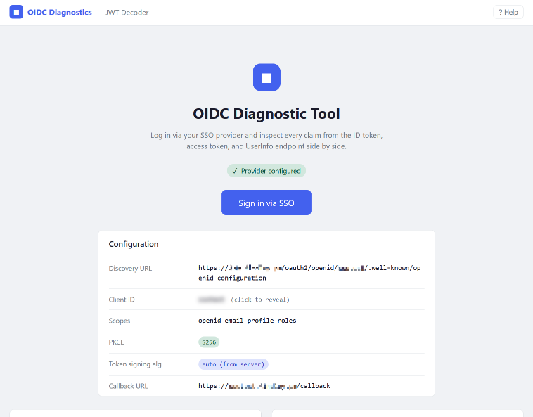

# OIDC Diagnostic Tool

A lightweight web application that acts as an OIDC client for diagnosing SSO systems. Log in via your provider (Keycloak, Kanidm, Authentik, Entra ID, Okta, etc.) and inspect every claim from the ID token, access token, and UserInfo endpoint side by side.

## Disclaimer

This tool was written collaboratively with AI: Claude Code - Claude Sonnet 4.6. [CLAUDE.md](CLAUDE.md) is included for reference.

---

## Tech Stack

| Layer | Technology |
| --- | --- |
| Language | Python 3.13 |
| Web framework | [Flask](https://flask.palletsprojects.com/) ≥ 3.0 |
| OIDC / OAuth2 | [Authlib](https://docs.authlib.org/) ≥ 1.3 |
| Cryptography | [cryptography](https://cryptography.io/) ≥ 42.0 (JWT key parsing) |
| HTTP client | [Requests](https://requests.readthedocs.io/) ≥ 2.31 |
| Multi-provider config | [PyYAML](https://pyyaml.org/) ≥ 6.0 |
| WSGI server | [Gunicorn](https://gunicorn.org/) ≥ 22.0 |
| Templating | [Jinja2](https://jinja.palletsprojects.com/) (bundled with Flask) |
| Frontend | Vanilla CSS + Vanilla JS — no framework, no build step |
| JWT verification (browser) | Web Crypto API — RS/PS/ES family signature verification entirely in-browser |

---

## Features

### Claims view

- **Five-tab claims view** — ID Token · Access Token · UserInfo · Compare · Raw JWT
- **Compare tab** — shows every unique claim key across all three sources and flags ⚠ where the same claim has different values
- **Claim descriptions** — hover over any claim key to see a plain-English description of what it means
- **Scope labelling** — each claim is badged with the OIDC scope that defines it; filter by scope with one click
- **Empty-scope warnings** — highlights scopes that were granted but returned no claims
- **Live search** — filter claims by name or value instantly
- **Mask sensitive values** — blur `sub`, `email`, `name`, etc. for safe screenshotting
- **Token expiry countdown** — live timer in the nav bar and claims header
- **Token refresh** — refresh the access token without signing out (requires `offline_access` scope)
- **Copy buttons** — per-claim copy and full JSON export
- **Copy as curl** — one-click button that builds a ready-to-run `curl` command for the UserInfo endpoint using your current access token

### JWT decoder

- **Standalone decoder** — paste any token and decode it without logging in
- **Token visualiser** — colour-coded header · payload · signature display
- **Token type detection** — labels tokens as ID, Access, or Refresh from header `typ` (Keycloak, RFC 9068) with payload-claim fallback (`nonce` → ID, `scope`/`scp` → Access) for providers like Kanidm that emit no `typ`
- **JWE detection** — encrypted refresh tokens (5-part JWEs, common with Kanidm) are recognised and shown as a static badge in the load-from-session panel rather than a dead-end clickable button
- **Claim descriptions** — hover over any claim key for a plain-English description; also shown in the comparison diff
- **Expiry warning** — immediately flags tokens whose `exp` has passed
- **Token timeline** — visual bar showing `iat` → now → `exp`, with remaining time or expiry age; updates live every second
- **JWKS signature verification** — paste a JWKS URI (auto-filled when signed in) and verify the token's signature locally using the Web Crypto API; supports RS256/384/512, PS256/384/512, ES256/384/512. Appears inline below the decoded payload when a JWS has been decoded
- **Decoder history** — every successful decode is preserved in the session (last 10, deduped by payload hash). Each row shows label/type/timestamp with **Recall**, **A**/**B** toggle (highlight to mark a row as Token A or Token B), and **✕ Delete** actions
- **A/B compare** — when you toggle A on one row and B on another, the claim-by-claim diff renders inline below the history table, with header-mismatch warnings and colour-coded only-A/only-B/changed rows
- **Push to decoder** — every raw token on the Claims page has an **Open in Decoder →** button. The decoder page itself shows a "Load from active session" panel with one-click ID / Access / Refresh buttons when you're signed in
- **Help button** — links to the in-app Reference page's JWT tab, which explains JWS vs JWE, anatomy, and how to obtain a JWT (DevTools, curl, Bearer headers, Keycloak admin console)

### Conformance & security analysis

- **OIDC conformance checks** — validates the provider's discovery document against OIDC Core 1.0 required and recommended fields
- **Security analysis** — checks for: `none` algorithm, HMAC signing keys, HTTPS on all endpoints, PKCE S256 support, `plain` PKCE, and algorithm strength (EC/PSS preferred over RSA PKCS#1 v1.5)
- **Token claim validation** — when signed in, validates `iss`, `aud`, `sub`, `exp`, `iat`, issuer match, and audience match against the configured client ID
- **RFC references** — every check cites the relevant specification (OIDC Core 1.0, RFC 8725, RFC 7636, RFC 9700, etc.)
- **Quick launch** — each provider card on the home page has a direct Conformance link that runs the check immediately

### Multi-provider mode

- **Provider cards** — each provider gets its own card with connectivity check and a direct Conformance link
- **Signed-in state** — the active provider card shows the signed-in username with Refresh, Sign out, and Claims buttons; inactive cards show Sign in
- **Provider Details panel** — a shared tabbed panel below the provider grid shows Configuration and Provider Metadata (`.well-known/openid-configuration`) for the selected provider; auto-selects the currently signed-in provider on load
- **SHOW_CONFIG in multi-provider** — when `SHOW_CONFIG=true`, the Provider Details panel shows each provider's discovery URL, client ID (click to reveal), scopes, PKCE method, and callback URL
- **Connectivity diagnostics** — each card shows whether the app server and browser can reach the provider; full error text is displayed inline for unreachable providers
- **Scope analysis** — shows which scopes were granted and highlights any that returned no claims

### UI

- **Dark mode** — full dark theme toggle in the nav bar; respects `prefers-color-scheme` by default, persisted to `localStorage`
- **Connectivity checker** — checks both the app server and your browser can reach the OIDC provider; displays latency (ms) on success or full error detail on failure
- **Provider discovery viewer** — fetches and displays the `.well-known/openid-configuration`, with your current PKCE method and signing algorithm highlighted
- **RP-initiated logout** — redirects to the provider's `end_session_endpoint` where supported
- **PKCE S256** — enabled by default; required by Kanidm, recommended everywhere
- **ES256 / RS256** — configurable token signing algorithm enforcement
- **Reference page** — built-in documentation covering connectivity, scopes, the OIDC flow, identity brokering (Keycloak as broker to upstream IdPs), JWT anatomy (JWS vs JWE, how to obtain one), and data & privacy
- **About page version badge** — shows the running version baked in at Docker build time from the git tag (or `vdev` for local runs)

---



---

## Quickstart with Docker

The fastest way to run the tool is with the pre-built image from GitHub Container Registry.

**1. Create a `.env` file:**

```bash
curl -o .env https://raw.githubusercontent.com/tfindley/sso_oidc_client_tool/main/.env.example
# Edit .env with your provider details
```

**2. Run with Docker Compose:**

```bash
docker compose up
```

Then open [http://localhost:5000](http://localhost:5000).

---

## Multi-Provider Setup

To configure more than one OIDC provider, use `providers.yml` instead of `.env` variables.

**1. Copy the example file:**

```bash
cp providers.example.yml providers.yml
```

**2. Edit `providers.yml`** with your provider details. Each provider entry requires:

| Field | Required | Description |
| --- | --- | --- |
| `name` | Yes | Display name shown on the login button |
| `id` | Yes | URL-safe identifier — used in `/login/<id>` and `/callback/<id>` |
| `discovery_url` | Yes | Provider's `/.well-known/openid-configuration` URL |
| `client_id` | Yes | OAuth2 client ID |
| `client_secret` | Yes | OAuth2 client secret |
| `scope` | No | Space-separated scopes (default: `openid email profile`) |
| `pkce_method` | No | `S256`, `plain`, or `disabled` (default: `S256`) |
| `token_signing_alg` | No | `ES256` or `RS256`; leave unset to accept server default |

**3. Register the callback URL** in each OIDC provider:

```text
https://<your-app>/callback/<id>
```

For example, a provider with `id: keycloak-dev` needs:

```text
https://your-app/callback/keycloak-dev
```

**4. Mount into Docker:**

```yaml
volumes:
  - ./providers.yml:/app/providers.yml:ro
```

When `providers.yml` is present it completely overrides the single-provider env var config. When it is absent, the app falls back to `OIDC_*` env vars as before.

---

## Provider Setup Guides

See [PROVIDERS.md](docs/PROVIDERS.md) for guides on how to add the OIDC Diagnostics app as a client.

---

## Reference Documentation

The in-app Reference page (`/reference`) is also available as standalone Markdown in [docs/reference/](docs/reference/):

| Document | Description |
| --- | --- |
| [Connectivity](docs/reference/connectivity.md) | Network topology, required paths, and connectivity troubleshooting |
| [Scopes & Claims](docs/reference/scopes-and-claims.md) | OIDC scope definitions and the claims each scope provides |
| [OIDC Flow](docs/reference/oidc-flow.md) | Authorization Code flow with PKCE — sequence diagram and explanation |
| [Identity Brokering](docs/reference/identity-brokering.md) | Keycloak as identity broker with an upstream IdP — extended flow and claim mapping |

---

## Conformance & Security Analysis

The **Conformance** page (`/conformance`) checks your provider against the OIDC specification and current security best practices without requiring any changes to your provider configuration.

**What it checks:**

| Category | Checks |
| --- | --- |
| Discovery Document | 7 REQUIRED fields (OIDC Core §4), 4 RECOMMENDED fields |
| Security — HTTPS | Issuer, authorization, token, JWKS, UserInfo, end-session endpoints |
| Security — Algorithms | `none` forbidden (RFC 8725 §2.1), HMAC keys warned (§2.7), EC/PSS preferred over PKCS#1 (§3.2) |
| Security — PKCE | S256 required, `plain` warned (RFC 7636), no PKCE warned for public clients |
| Optional Features | RP-initiated logout, back-channel logout, `claims` parameter, signed request objects |
| Token Validation | `sub`, `iss`, `aud`, `exp`, `iat` present; issuer and audience match; token not expired; signing algorithm |

Token validation runs automatically when you are signed in to the provider being checked. All checks cite the relevant RFC or specification section.

---

## Configuration Reference

All single-provider configuration is via environment variables in a `.env` file. When `providers.yml` is present, the `OIDC_*` variables are ignored.

### OIDC Provider

| Variable | Required | Default | Description |
| --- | --- | --- | --- |
| `OIDC_DISCOVERY_URL` | Yes | — | Provider's `/.well-known/openid-configuration` URL |
| `OIDC_CLIENT_ID` | Yes | — | OAuth2 client ID |
| `OIDC_CLIENT_SECRET` | Yes | — | OAuth2 client secret |
| `OIDC_SCOPE` | No | `openid email profile` | Space-separated scopes to request |
| `OIDC_PKCE_METHOD` | No | `S256` | PKCE method: `S256`, `plain`, or `disabled` |
| `OIDC_TOKEN_SIGNING_ALG` | No | *(auto)* | Enforce a signing algorithm: `ES256` or `RS256`. Unset = accept server's default |

### Flask / Server

| Variable | Required | Default | Description |
| --- | --- | --- | --- |
| `SECRET_KEY` | Yes | *(random, ephemeral)* | Flask secret key — set a fixed value or session-related signing won't survive restarts |
| `SESSION_ENCRYPTION_PEPPER` | Yes | *(random, ephemeral)* | Server-side pepper combined with each user's per-session key to encrypt session data on disk. Treat as critically as `SECRET_KEY`. Rotating it invalidates all active sessions. Generate: `python3 -c "import secrets; print(secrets.token_hex(32))"` |
| `SESSION_FILE_DIR` | No | `/tmp/flask_session` | Directory where encrypted session ciphertext is written. Use a tmpfs mount to avoid disk persistence across container restarts. |
| `PORT` | No | `5000` | Port to listen on |
| `FLASK_DEBUG` | No | `false` | Enable Flask debug mode — **never use in production**. Debug mode exposes the pepper, the secret key, and in-flight plaintext session data via the Werkzeug debugger and tracebacks. |
| `PREFERRED_URL_SCHEME` | No | *(auto)* | Force `https` in callback URLs if your proxy doesn't send `X-Forwarded-Proto` |
| `SESSION_COOKIE_SECURE` | No | `false`* | Force the `Secure` flag on the session cookie (*auto-set when `PREFERRED_URL_SCHEME=https`) |
| `SESSION_LIFETIME_MINUTES` | No | `120` | Maximum session lifetime in minutes. When a session expires you are signed out regardless of whether the underlying tokens are still valid. The nav bar shows the session-expiry countdown alongside the token-expiry countdown. |

### UI configuration

| Variable | Required | Default | Description |
| --- | --- | --- | --- |
| `SHOW_CONFIG` | No | `false` | Show the configuration card on the landing page (client ID is always masked — click to reveal). In multi-provider mode, shows a collapsible configuration section on each provider card. |
| `PRIVACY_NOTICE` | No | `false` | Show a data-handling notice on the landing page — recommended for public or shared deployments |
| `BANNER_TEXT` | No | *(hidden)* | Custom message shown on the landing page before the login button — useful for demo or maintenance notices |
| `BANNER_TYPE` | No | `info` | Style of the custom banner: `info`, `warning`, `error`, or `success` |

---

## Scopes Reference

| Scope | Claims provided | Standard? |
| --- | --- | --- |
| `openid` | `sub`, `iss`, `aud`, `exp`, `iat` | Required |
| `email` | `email`, `email_verified` | OIDC |
| `profile` | `name`, `given_name`, `family_name`, `preferred_username`, `picture`, `locale`, `zoneinfo`, `updated_at` | OIDC |
| `address` | `address` | OIDC — rarely used |
| `phone` | `phone_number`, `phone_number_verified` | OIDC — rarely used |
| `offline_access` | *(no new claims — requests a refresh token)* | OIDC |
| `roles` | `realm_access`, `resource_access` | Keycloak-specific |
| `groups` | `groups` | Provider-specific |

Additional claims beyond these are typically available via **custom scopes** configured in your provider. The **Provider Metadata** panel on the home page lists `claims_supported` — every claim the server can return.

---

## Logout

The **Sign out** option in the user menu attempts **RP-initiated logout**: it redirects the browser to the provider's `end_session_endpoint` with the current ID token as `id_token_hint`, which terminates the SSO session server-side. If the provider doesn't support this endpoint (e.g. Kanidm), a local-only session clear happens instead.

### Keycloak — RP-initiated logout setup

In Keycloak, register the app's base URL as a **Valid post-logout redirect URI** in your client settings:

```text
https://your-app/
```

After signing out the browser will be redirected back to the app's landing page.

### Logout endpoint — what this app does and doesn't support

| Logout type | Description | Supported |
| --- | --- | --- |
| **RP-initiated logout** | App redirects browser to provider's `end_session_endpoint` to terminate the SSO session | ✓ Yes |
| **Frontchannel logout** | Provider loads the app's logout URL in a hidden iframe to notify it of a logout | ✗ No |
| **Backchannel logout** | Provider POSTs a signed JWT to the app's logout URL (server-to-server) | ✗ No |

This is a diagnostic tool; frontchannel and backchannel logout are not implemented. Pointing Keycloak's **Backchannel Logout URL** at `/logout` will not work — the route expects a browser redirect, not a server-side POST.

---

## Reverse Proxy (Traefik, nginx, etc.)

The app automatically reads `X-Forwarded-Proto` and `X-Forwarded-Host` headers, so HTTPS callback URLs generate correctly behind a TLS-terminating proxy with no extra configuration. Traefik forwards these headers by default.

If your proxy does not forward `X-Forwarded-Proto`, set `PREFERRED_URL_SCHEME=https` in `.env`.

Ensure the callback URL registered in your OIDC provider matches what the app generates — use the **Configuration** card (enable `SHOW_CONFIG=true`) or the home page to verify the exact callback URL being used.

---

## Building Locally

```bash
# Without Docker
pip install -r requirements.txt
cp .env.example .env
# Edit .env
python app.py

# With Docker (build from source)
docker compose -f docker-compose.build.yml up --build
```

---

## Tests

A pytest harness covers pure helpers (`_detect_token_type`, `decode_jwt`, `_update_decoder_history`) and Flask route smoke tests (`/`, `/decode`, `/reference`, `/about`, `/decode/history/*`). It does not exercise the OIDC callback flow or anything that would need an outbound network call — those need a real provider.

```bash
pip install -r requirements-dev.txt
pytest tests/ -q
```

Tests run automatically on every pull request via [.github/workflows/test.yml](.github/workflows/test.yml).

---

## Docker Image Tags

Images are published to `ghcr.io/tfindley/sso_oidc_client_tool` on every push to `main` and on version tags.

| Tag           | When                         |
| ------------- | ---------------------------- |
| `latest`      | Every push to `main`         |
| `main`        | Every push to `main`         |
| `v1.2.3`      | On a `v1.2.3` git tag        |
| `1.2`         | On a `v1.2.x` git tag        |
| `sha-abc1234` | Every commit (immutable ref) |

Multi-arch: `linux/amd64` on every build; `linux/amd64` + `linux/arm64` on version tags.

---

## Data Handling & Privacy

### What the app stores

| Data | Where stored | When cleared |
| --- | --- | --- |
| ID token (JWT string) | Encrypted on server disk | Sign out, or session expiry |
| Access token (JWT string) | Encrypted on server disk | Sign out, or session expiry |
| Refresh token (if issued) | Encrypted on server disk | Sign out, or session expiry |
| UserInfo claims (JSON) | Encrypted on server disk | Sign out, or session expiry |
| Display username | Encrypted on server disk | Sign out, or session expiry |
| Decryption key | Browser cookie only — never on the server | Sign out, or session expiry |

### Zero-knowledge sessions

Session data is stored on the server as **authenticated ciphertext** (Fernet, AES-128-CBC + HMAC-SHA256). The encryption key for each session is split between two places:

- A random 32-byte per-session key that lives only in the user's browser cookie.
- A server-held pepper (`SESSION_ENCRYPTION_PEPPER`) that is the same for every user.

Both halves are required to decrypt session data via HKDF-SHA256. Properties:

- The server cannot passively read any user's session — the per-session key is never on the server outside the brief window when that user's request is being handled.
- An attacker who steals the disk (backup leak, volume mount, container image) gets only opaque bytes, because they don't have the per-session keys.
- An attacker who steals one user's cookie still needs the pepper to decrypt their data offline.
- Rotating `SESSION_ENCRYPTION_PEPPER` invalidates **all** active sessions immediately — useful for emergency revocation.
- Logging out or letting the session expire causes Fernet's TTL check to reject the ciphertext on next read; the disk file is also actively removed at logout.

Session lifetime is **independent of token lifetime**. `SESSION_LIFETIME_MINUTES` controls how long the encrypted blob is decryptable, regardless of whether the underlying access token is still valid. The nav bar shows both countdowns.

### What operators can and cannot see

| | Can the operator see it? |
| --- | --- |
| User's **password** | **No.** Users authenticate directly on the OIDC provider's login page. This app never receives or handles passwords. |
| **Authorization code** | Briefly, in the `/callback?code=…` URL. Codes are single-use and expire within seconds of being issued. Server access logs may record this URL. |
| **Access / ID tokens** | Only while a request from that user is in flight. The plaintext exists in server memory just long enough to render the response, then is discarded. The on-disk record is encrypted with a key the server doesn't hold. The default code does not log tokens. `FLASK_DEBUG=true` defeats this guarantee — never enable debug mode on a public instance. |
| **User profile claims** | Same as above — visible only during request handling. |
| **Refresh token** | Same as above. Not requested unless `offline_access` is in the configured scopes. |

This is a stronger trust model than the previous client-side cookie design, but you are still trusting the operator to run the published code unmodified. Sign in only on instances operated by people you trust, and grant the minimum scopes needed.

### Recommendations for public deployments

- Set `PRIVACY_NOTICE=true` to display a data-handling statement on the landing page.
- Keep `FLASK_DEBUG=false` (the default). Debug mode exposes the pepper, the secret key, and in-flight plaintext session data.
- Set both `SECRET_KEY` and `SESSION_ENCRYPTION_PEPPER` to strong random values. Keep them in `.env` (or your secret store) — never check them into git. Rotating the pepper invalidates all sessions; rotating the secret key invalidates session-ID cookies.
- Run behind HTTPS and set `PREFERRED_URL_SCHEME=https` so the session cookie carries the `Secure` flag and cannot be sent over plain HTTP.
- Mount `SESSION_FILE_DIR` as a tmpfs if you want session ciphertext to disappear on container restart even before its TTL expires.
- Request the minimum scopes: `openid email profile` is sufficient to demonstrate the OIDC flow without granting broader permissions.
- Do **not** request `offline_access` on a public demo — long-lived refresh tokens become part of the session ciphertext.
- Treat your server access logs as sensitive; they may contain short-lived authorization codes.

**Recommended for a quick public demo:** Google is the easiest to set up (15 minutes, no server, free) and has the widest reach — any visitor can test with their existing Google account. Set `OIDC_SCOPE=openid email profile`, request only the scopes you need, and set `PRIVACY_NOTICE=true`.

---

## Development Cost

This tool was developed with Claude Code (Claude Sonnet 4.6) over approximately **6 days** (9–15 April 2026), through multiple sessions covering full feature implementations, architectural pivots, and thorough testing and debugging cycles.

| Metric | Estimate |
| --- | --- |
| Development time | ~6 days |
| Total tokens processed | ~12–15 million |
| Estimated AI API credit spend | ~$40–60 USD |

Token and cost estimates are approximate; prompt caching (active within sessions) means the dollar figure likely understates the raw token volume. This is not a vibe-coded prototype — it reflects sustained, iterative development with multiple rewrites and refinement cycles to reach the current state.

---

## License

AGPL

---

## Author Information

### Tristan Findley

Find out more at [tfindley.co.uk](https://tfindley.co.uk).

If you're a fan of my work and would like to show your support:

[](https://ko-fi.com/tfindley)
